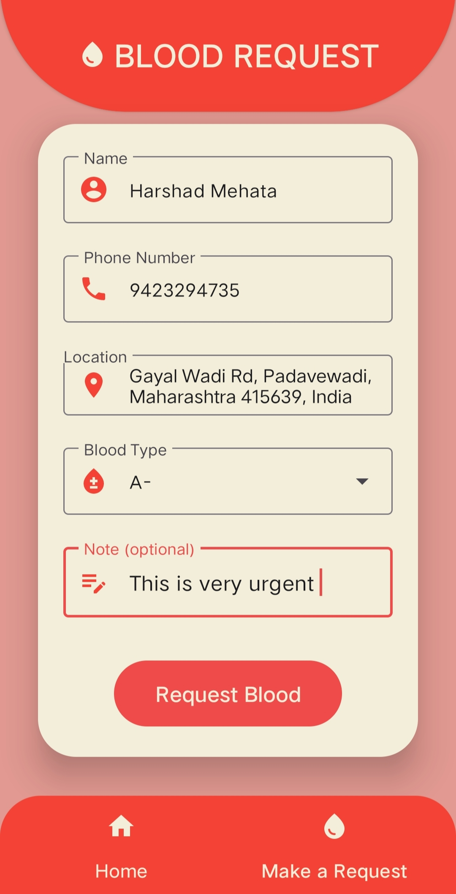

# Blood Link

This is a mobile app designed to connect blood donors with those in need of blood. The app allows users to create a profile, create and respond to blood requests.

## Features

- User registration and profiles: users can create an account, provide personal information, and edit their profile and preferences.

- Blood requests: users can create requests for specific blood types and receive notifications when eligible donors are found.

- Donor rating system: donors are rated based on reliability and timeliness, helping users identify trustworthy donors in their area.

- Donation history: users can view their donation history and receive reminders when they are eligible to donate again.

- Blood donation education: users can access educational resources on blood donation, eligibility requirements, and the donation process.

## Screenshots

## Technologies Used

- Android Studio 

- Firebase

- Google Maps API

## Installation

To install the app, clone this repository in Android Studio. You will also need to set up a Firebase account and add your API keys to the project.

## Contributors

- Om Chandrakant Parab

- Shweta Avadhut Yenaji

- Tanvi Prashant Sawant

- Shivam Sanjay Parab
